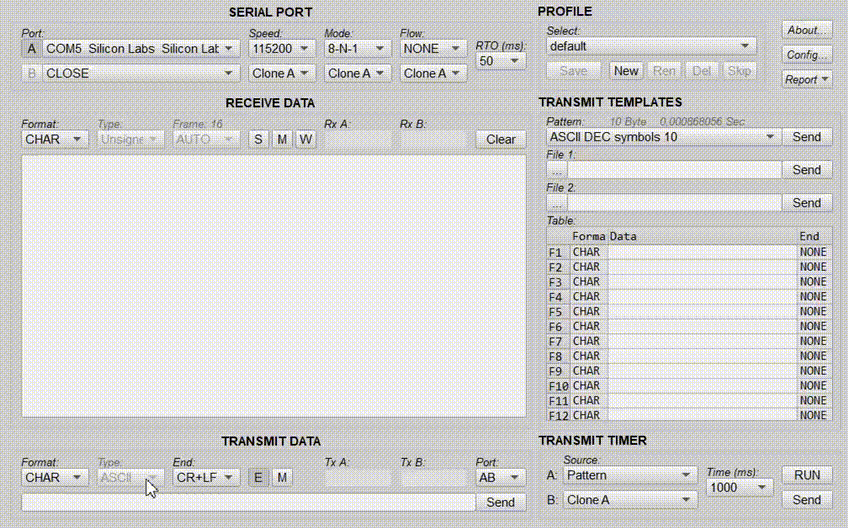

# PLC-simulations
### Conveyor Control System (CODESYS ST)
Проект управления конвейером на языке Structured Text
в среде CODESYS с имитацией работы электропривода.

[Conveyor Control System (CODESYS ST)](https://github.com/nekhusainow/plc-simulations/tree/main/codesys-conveyor-control-st)

### Motor Control System (CODESYS LD)
Проект управления электродвигателем в среде CODESYS
на языке Ladder Diagram (LD).
Реализованы базовые режимы пуска и остановки,
логика управления и индикация состояния.

[Motor Control System (CODESYS LD)](https://github.com/nekhusainow/plc-simulations/tree/main/codesys-motor-control-ld)

### Automated Painting Line Control System (CODESYS)
Модель автоматизированной покрасочной линии
с подвесным конвейером, электроприводами
и системой нанесения краски.

[Automated Painting Line Control System (CODESYS)](https://github.com/nekhusainow/plc-simulations/tree/main/codesys-painting-line)

### FreeRTOS ADC Control UART (STM32)
Встроенная система управления задачей измерения АЦП
на базе STM32 с использованием FreeRTOS.

[FreeRTOS ADC Control UART (STM32)](https://github.com/nekhusainow/plc-simulations/tree/main/freertos-adc-uart-control#freertos-adc-control-uart-stm32)

### Industrial SCADA System with PLC Emulation (TRACE MODE 6)
Демо-проект промышленной SCADA-системы
с эмуляцией PLC и технологического объекта.

[Industrial SCADA System with PLC Emulation (TRACE MODE 6)](https://github.com/nekhusainow/plc-simulations/tree/main/scada-industrial-demo-tracemode)

