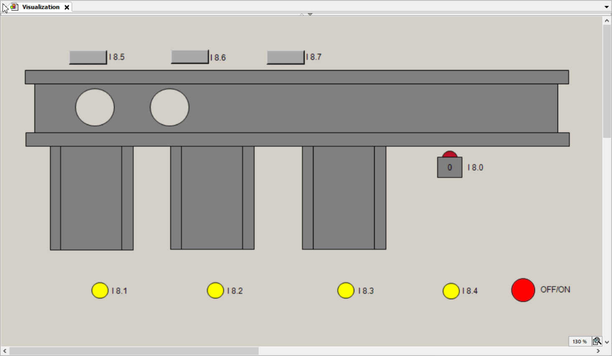

# Conveyor Control System (CODESYS ST)

## Описание
Демо-проект системы управления конвейером,
реализованный в среде CODESYS 3.5 с использованием языка Structured Text (ST).

## Функциональность
- Управление движением конвейера
- Имитация движения нескольких объектов
- Подсчёт прошедших изделий
- Визуализация работы системы

## Реализация
- Язык программирования: Structured Text (ST)
- Реализована логика обработки сигналов датчиков
- Смоделировано циклическое движение объектов
- Программа протестирована в режиме Online Simulation

## Инструменты
- CODESYS 3.5
- IEC 61131-3
- Симуляция без физического ПЛК

## 🎥 Демонстрация работы

## 🎓 Назначение
Учебный проект, выполненный как типовая задача автоматизации
конвейерной линии с элементами логики реального технологического процесса.
