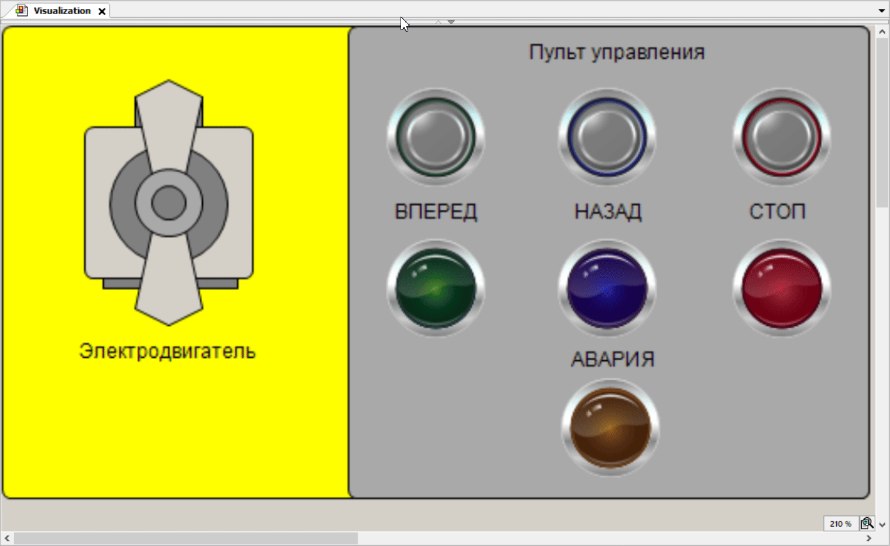

# Motor Control System (CODESYS LD)

## Описание
Демо-проект системы управления электродвигателем с реверсом,
реализованный в CODESYS 3.5.
Проект демонстрирует навыки программирования ПЛК на языке LD
и создания визуализации HMI.

## Функциональность
- Вращение двигателя вперёд / назад
- Защита от одновременного включения направлений
- Аварийная блокировка при ошибочных командах
- Кнопка сброса аварии
- Визуальная индикация состояний двигателя

## Реализация
- Язык управления: Ladder Diagram (LD)
- Визуализация и анимация: ST
- Использованы логические блокировки и аварийные флаги
- Программа протестирована в режиме Online Simulation

## Инструменты
- CODESYS 3.5
- IEC 61131-3
- Симуляция без физического ПЛК

## Демонстрация работы

## Назначение
Учебный проект, выполненный как типовая задача автоматизации,
аналогичная реальным системам управления электроприводом.
